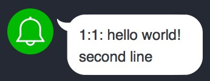

# drone-line-notify-nodejs

## Usage
```
pipeline:
  line-notify:
    group: notify
    image: hphuang/drone-line-notify-nodejs
    secrets: [ line_notify_access_token ]
    message: 'hello world! %0D%0Asecond line'
    when:
      event: push
      branch: master
```

## Demo


# Reference
* https://notify-bot.line.me/doc/en/
* https://docs.drone.io/plugins/examples/bash/